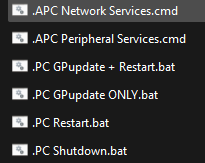
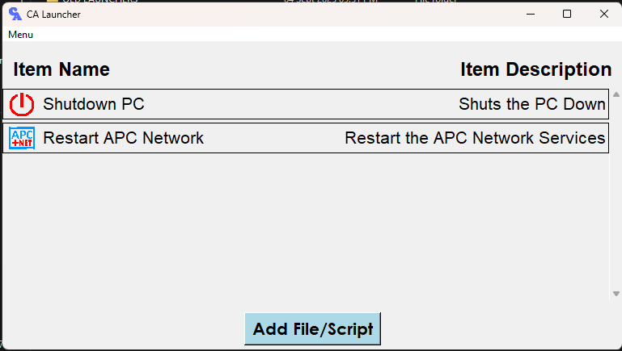

# CA Launcher

## Overview

CA Launcher (Compact App Launcher) is a user-friendly application designed to help users manage and launch their frequently used files and scripts from a single interface. Built using Python and the Tkinter library, it provides an intuitive graphical user interface (GUI) for easy interaction.

## Features

- Add and organize shortcuts to files, scripts, and documents.
- Assign custom names, descriptions, and icons to each shortcut.
- Edit or remove shortcuts as needed.
- Launch files and scripts directly from the application.
- Simple and intuitive graphical user interface.

## Usage

* Useful for command line bat files and cmd scripts, or even exe's.

 

* You can use CA Launcher to set your Files and Scripts into one application.



* You will be able to Give the item a name, a description and an icon.

## Project Launcher Windows App

```
https://github.com/Zubair-A-Davids/CA-Launcher/tree/dc01469e998153ddd78c7e30089f6aeb7bf89083/Launcher
```

## Installation

1. Clone the repository:

   ```
   git clone <repository-url>
   cd CA-Launcher
   ```
2. Install the required dependencies:

   ```
   pip install -r requirements.txt
   ```

## Usage

- To run the application, execute the `main.py` file:

  ```
  python src/main.py
  ```
- Alternatively, you can run the pre-built executable located in the `dist` folder:

  ```
  ./dist/CA-Launcher.exe
  ```

## Building the Executable

To create the executable using PyInstaller, run the following command:

```
pyinstaller --onefile --name CA-Launcher --distpath dist src/main.py
```

This will generate the executable in the `dist` folder with the specified name.

## License

This project is licensed under the MIT License. See the LICENSE file for details.
